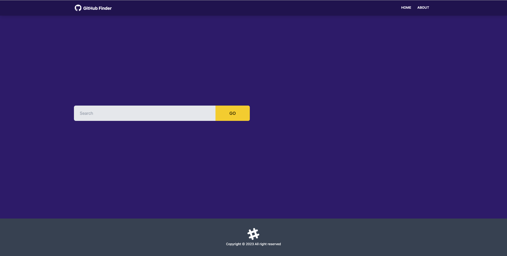
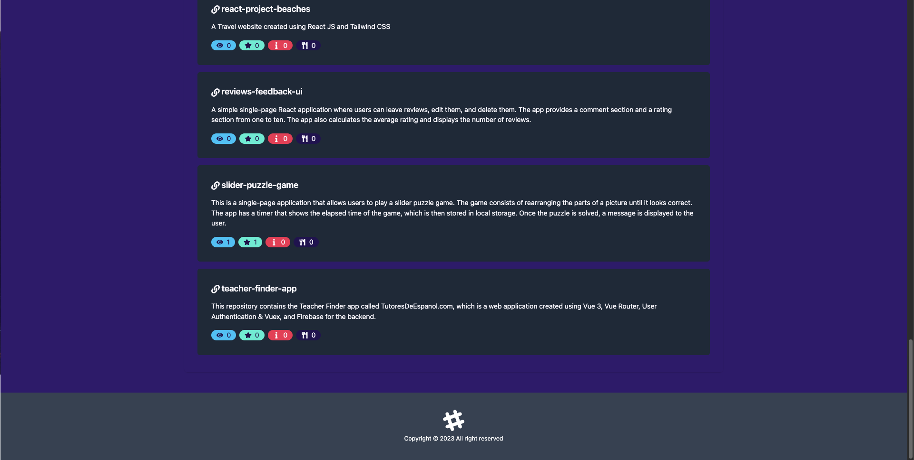
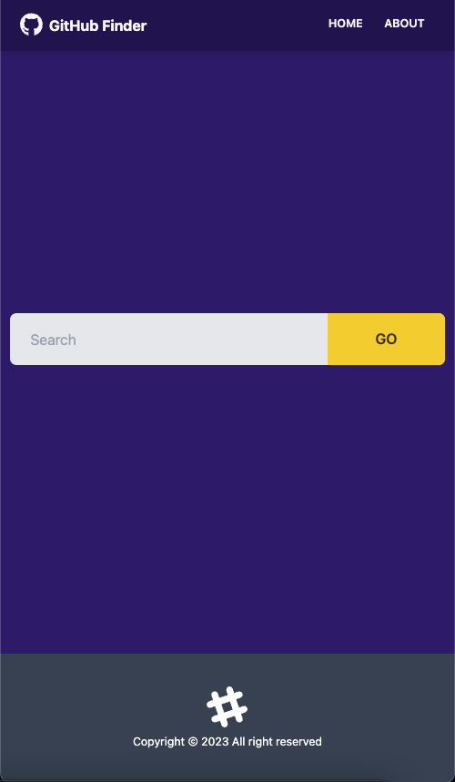
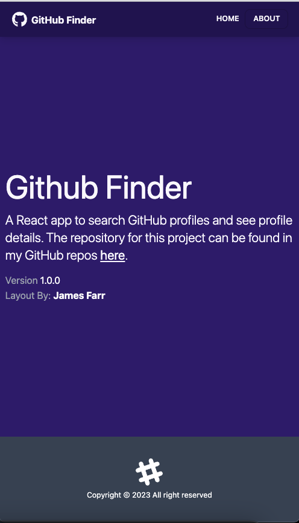

# GitHub Finder App

A web application built using React, Context API, React Router, Axios, Tailwind CSS & Daisy UI that allows users to search GitHub users and view information about their top 10 most recent repositories.

## Table of Contents

- [About](#about)
- [Installation](#installation)
- [Usage](#usage)
- [Screenshots](#screenshots)
- [Components](#components)
- [Pages](#pages)
- [Context Files](#context-files)
- [Contributing](#contributing)
- [License](#license)

## About

The GitHub Finder app is a simple React application that allows users to search for GitHub users and view information about their top 10 most recent repositories. The app consists of four pages: About, Home, NotFound, and User. There are three component files - Layout, Repos, and User - and the app level state is stored in the Context folder.

## Installation

To install the app, simply clone the repository to your local machine and run the following command in the project directory:

## Usage

To use the app, simply run the following command in the project directory:

This will start the development server and open the app in your default browser. From there, you can use the search bar to search for GitHub users and view their repositories.

## Screenshots

## Components

- Layout
- Alert
- Footer
- Navbar
- Spinner
- Repos
  - RepoItem
  - RepoList
- User
  - UserItem
  - UserResults
  - UserSearch

## Pages

- About
- Home
- NotFound
- User

## Context Files

- github
  - GithubActions
  - GithubContext
  - GithubReducer
- alert
  - AlertContext
  - AlertReducer

